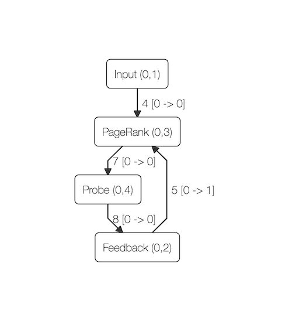

# Timely Diagnostics

Diagnostic tools for [timely
dataflow](https://github.com/TimelyDataflow/timely-dataflow)
computations. Timely dataflows are data-parallel and scale from single
threaded execution on your laptop to distributed execution across
clusters of computers. Each thread of execution is called a *worker*.

The tools in this repository have the shared goal of providing
insights into timely dataflows of any scale, in order to understand
the structure and resource usage of a dataflow.

Each timely worker can be instructed to publish low-level event
streams over a TCP socket, by setting the `TIMELY_WORKER_LOG_ADDR`
environment variable. These logging streams are rather high volume —
what better tool to analyse them than timely itself? In order to avoid
confusion, we will refer to the workers of the dataflow *that is being
analysed* as the `source peers`. The workers of the diagnostic
computation we will refer to as `inspector
peers`. [tdiag-connect](./connect) is a library of utiltities that can
be used by inspector peers to source event streams from source peers.

All tools are provided under a unified CLI, [tdiag](./tdiag).

## Getting Started

`tdiag` is the CLI to all diagnostic tools. Install it via cargo:

``` shell
cargo install tdiag
```

All diagnostic computations require you to specify the number of
workers running in the source computation via the `source-peers`
parameter. This is required in order to know when all source event
streams are connected.

### `graph` - Visualize the Source Dataflow

In order to better understand what is happening inside of a dataflow
computation, it can be invaluable to visualize the structure of the
dataflow. Start the `graph` diagnosis:

``` shell
tdiag --source-peers 2 graph --out graph.html
```

You should be presented with a notice, informing you that `tdiag` is
waiting for as many connections as specified via `--source-peers` (two
in this case).

In a separate shell, start your source computation. In this case, we
will analyse the [Timely PageRank
example](https://github.com/TimelyDataflow/timely-dataflow/blob/master/timely/examples/pagerank.rs). From
inside the `timely-datflow/timely` sub-directory, run:

``` shell
TIMELY_WORKER_LOG_ADDR="127.0.0.1:51317" cargo run --example pagerank 1000 1000000 -w 2
```

Most importantly, `TIMELY_WORKER_LOG_ADDR="127.0.0.1:51317"` will
cause the source workers to connect to our diagnostic computation. The
`-w` parameter specifies the number of workers we want to run the
PageRank example with. Whatever we specify here therefore has to match
the `--source-peers` parameter we used when starting `tdiag`.

Once the computation is running, head back to the diagnostic shell,
where you should now see something like the following:

``` shell
$ tdiag --source-peers 2 graph --out graph.html

Listening for 2 connections on 127.0.0.1:51317
Trace sources connected
Press enter to generate graph (this will crash the source computation if it hasn't terminated).
```

At any point, press enter as instructed. This will produce a fully
self-contained HTML file at the path specified via `--out`
(`graph.html` in this example). Open that file in any modern browser
and you should see a rendering of the dataflow graph at the time you
pressed enter. For the PageRank computation, the rendering should look
similar to the following:



You can use your mouse or touchpad to move the graph around, and to
zoom in and out.
